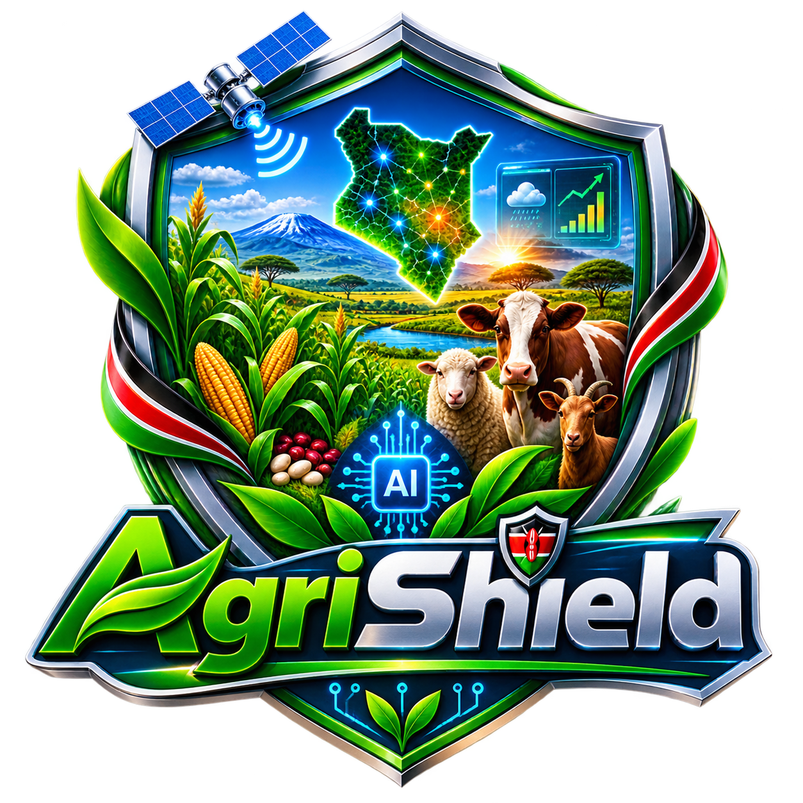

<div align="center">

  

  <p><em>Protecting Kenya's Food Security, Ensuring Future Sustainability.</em></p>


**A Hierarchical, Agentic AI Predictive Intelligence System for Crop Yield and Livestock Forage Risk in Kenya**

[](https://www.python.org/)
[](https://fastapi.tiangolo.com/)
[](https://streamlit.io/)
[](https://build.nvidia.com/)
[](#license)
[](#)

</div>

---

## 📖 Table of Contents

- [About the Project](#about-the-project)
- [The Problem](#the-problem)
- [The Solution](#the-solution)
- [Key Features](#key-features)
- [System Architecture](#system-architecture)
- [Tech Stack](#tech-stack)
- [Project Structure](#project-structure)
- [Getting Started](#getting-started)
- [Data Sources](#data-sources)
- [The Team](#the-team)
- [The 5 Critical Questions](#the-5-critical-questions)
- [Roadmap](#roadmap)
- [Documentation](#documentation)
- [License](#license)
- [Acknowledgments](#acknowledgments)

---

## 🎯 About the Project

**AgriShield** is a predictive intelligence system that forecasts agricultural risks across Kenyan counties before disasters happen. It predicts both **crop yield shocks** and **livestock forage deficits**, then uses an AI assistant named **Gria** to translate complex predictions into plain-English insights, dynamic maps, and professional PDF reports.

The system works at two levels:
- **County Level:** Detailed risk predictions for individual counties.
- **Regional Level:** Aggregated intelligence for entire regions like the Rift Valley or Eastern Kenya.

> AgriShield shifts agricultural disaster management from **reactive** (responding after crops fail) to **proactive** (acting before the damage occurs).

---

## ⚠️ The Problem

Agriculture contributes about **33% of Kenya's GDP** and employs over **75% of the rural population**. Yet the sector faces serious challenges:

1. **Reactive Responses:** Early Warning Systems only activate *after* crops have already failed or livestock are already starving.
2. **Siloed Solutions:** Existing tools focus only on crops *or* only on livestock, never both together.
3. **Complex Outputs:** Current systems produce technical GIS maps that county officers cannot easily understand or act on.
4. **The "Black Box" Problem:** Machine learning models give raw numbers without explaining *why*, making it hard for officials to justify budgets and actions.

The result is billions of shillings lost every year to preventable agricultural disasters.

---

## 💡 The Solution

AgriShield combines three powerful capabilities into one intelligent system:

### 1. Predictive Machine Learning
A champion **XGBoost** model predicts the probability of crop failure or forage deficit for each county, based on rainfall, temperature, soil moisture, and vegetation health.

### 2. Gria — The Agentic AI Assistant
Powered by **NVIDIA NIM**, Gria is an intelligent agent that:
- Reads uploaded files (PDFs, images, spreadsheets, Word documents)
- Converts messy data into the exact format the model needs
- Explains predictions in plain English
- Generates charts and maps on demand

### 3. Automated Reporting
The system compiles predictions, visualizations, and action plans into a branded, downloadable **PDF report** — ready for county directors and policy makers.

---

## ✨ Key Features

| Feature | Description |
|---------|-------------|
| 📊 **Risk Dashboard** | Real-time risk scores with visual gauges for any county |
| 🗺️ **Interactive Map** | Color-coded map of all 47 Kenyan counties by risk level |
| 🤖 **Gria AI Chat** | Ask questions in plain English and get instant insights |
| 📤 **Smart File Upload** | Upload CSV, PDF, Word, or images — Gria converts them automatically |
| 📈 **Dynamic Charts** | AI-generated charts that update based on your questions |
| 🔄 **County Comparison** | Compare risk levels between two or more counties side by side |
| 🌍 **Regional Overview** | See aggregated risk across entire regions |
| 📅 **Historical Trends** | Track how risk has changed over time |
| 🎛️ **Scenario Planning** | Adjust rainfall and temperature to see "what-if" outcomes |
| 📄 **PDF Reports** | One-click professional reports for decision makers |
| 🌐 **Multi-Language** | Available in English and Swahili |

---

## 🏗️ System Architecture

AgriShield uses a clean three-layer architecture:

```text
┌─────────────────────────────────────────────────────────────┐
│ STREAMLIT FRONTEND │
│ (Dashboard, Maps, Uploads, PDF Download) │
└─────────────────────────┬───────────────────────────────────┘
│ HTTP Requests
▼
┌─────────────────────────────────────────────────────────────┐
│ FASTAPI BACKEND │
│ ┌──────────────┐ ┌──────────────┐ ┌──────────────────┐ │
│ │ Prediction │ │ Gria Agent │ │ PDF Generator │ │
│ │ Service │ │ (NVIDIA NIM) │ │ (ReportLab) │ │
│ └──────┬───────┘ └──────┬───────┘ └──────────────────┘ │
└─────────┼─────────────────┼─────────────────────────────────┘
│ │
▼ ▼
┌──────────────────┐ ┌──────────────────────────────────────┐
│ XGBoost Model │ │ File Processor │
│ (.joblib) │ │ (PDF, Image, Excel, Word parsing) │
└──────────────────┘ └──────────────────────────────────────┘
```

**How a prediction flows through the system:**
1. The user selects a county or uploads a file in the frontend.
2. The frontend sends the request to the FastAPI backend.
3. The backend passes the data to the XGBoost model for prediction.
4. Gria interprets the result and generates plain-English insights.
5. The frontend displays the risk score, charts, and downloadable report.

---

## 🛠️ Tech Stack

| Layer | Technology | Purpose |
|-------|-----------|---------|
| **Frontend** | Streamlit | Interactive web dashboard |
| **Backend** | FastAPI | High-performance API server |
| **AI Agent** | NVIDIA NIM + LangChain | Gria intelligent assistant |
| **ML Models** | XGBoost, Scikit-learn | Crop and forage risk prediction |
| **Model Format** | joblib | Save and load trained models |
| **Visualization** | Plotly, Folium | Dynamic charts and maps |
| **PDF Generation** | ReportLab | Automated professional reports |
| **File Parsing** | pdfplumber, python-docx, Pillow | Process uploaded documents |
| **Data Pipeline** | Pandas, NumPy, GeoPandas | Data cleaning and processing |

---

## 📁 Project Structure

```text
agrishield/
│
├── apps/
│ ├── backend/ # FastAPI backend and Gria AI
│ │ ├── main.py # Application entry point
│ │ ├── config.py # Backend settings
│ │ ├── Dockerfile # Deployment container
│ │ ├── routers/ # API endpoints
│ │ ├── agents/ # Gria AI logic
│ │ ├── schemas/ # Data validation models
│ │ ├── services/ # Business logic
│ │ └── middleware/ # Authentication
│ │
│ └── frontend/ # Streamlit dashboard
│ ├── streamlit_app.py # Main application
│ ├── pages/ # Dashboard views
│ ├── components/ # Reusable UI blocks
│ └── assets/ # Styles, logos, maps
│
├── data_pipeline/ # Data collection and cleaning
│ ├── notebooks/ # Step-by-step data work
│ ├── data/ # raw, processed, geospatial
│ └── scripts/ # Production data scripts
│
├── ml-models/ # Machine learning development
│ ├── models/ # Saved .joblib models
│ ├── notebooks/ # Model experiments
│ └── scripts/ # Training and prediction
│
├── tests/ # Testing evidence
└── docs/ # Report, slides, diagrams
```


---

## 🚀 Getting Started

Follow these steps to set up AgriShield on your local machine.

### Prerequisites

- Python 3.10 or higher
- pip (Python package manager)
- An NVIDIA NIM API key (get one free at [build.nvidia.com](https://build.nvidia.com))

### Step 1: Clone the Repository

```bash
git clone https://github.com/your-username/agrishield.git
cd agrishield
```

### Step 2: Create a Virtual Environment

```bash
python -m venv venv

# Activate on Windows
venv\Scripts\activate

# Activate on macOS/Linux
source venv/bin/activate
```

### Step 3: Install Dependencies

Each part of the project has its own requirements file. Install only what you need.

```bash
# For the backend
pip install -r apps/backend/requirements.txt

# For the frontend
pip install -r apps/frontend/requirements.txt

# For the data pipeline
pip install -r data_pipeline/requirements.txt

# For machine learning
pip install -r ml-models/requirements.txt
```

### Step 4: Set Up Environment Variables

Copy the example files and add your real values.

```bash
# Backend
cd apps/backend
cp .env.example .env

# Frontend
cd ../frontend
cp .env.example .env
```
Open each `.env` file and add your `NVIDIA_API_KEY` and `API_KEY`.

### Step 5: Run the Backend

```bash
cd apps/backend
uvicorn main:app --reload
```

The API will be available at `http://127.0.0.1:8000`.\
API documentation is at `http://127.0.0.1:8000/docs`.

### Step 6: Run the Frontend

Open a new terminal:

```bash
cd apps/frontend
streamlit run streamlit_app.py
```

The dashboard will open at `http://localhost:8501`.

---

## 📊 Data Sources

AgriShield uses open-source data to ensure transparency and accessibility.

| **Source** | **Data Provided** |
| :--- | :---|
| **Open-Meteo** | Historical rainfall, temperature, soil moisture |
| **NASA POWER** | Agroclimatology and solar radiation |
| **NASA AppEEARS** | NDVI vegetation and pasture health |
| **FAOSTAT** | National crop production statistics |
| **KNBS** | County population and economic data |
| **HDX Kenya** | County boundary shapefiles |
| **FAO WaPOR** | Water productivity and forage indices |

---

## 👥 The Team

| **Member** | **Role** | **Responsibility** |
| :--- | :--- | :--- |
| **Member 1** | Team Lead — Backend & AI Architect | FastAPI, Gria AI, ML models, PDF generation |
| **Member 2** | Data Pipeline & Research Lead | Data collection, cleaning, EDA |
| **Member 3** | Frontend & Deployment Lead | Streamlit UI, cloud deployment, live demo |

---

## ❓ The 5 Critical Questions

Every strong capstone project must answer five questions. Here is how AgriShield answers them:

**What problem is being solved?**
The reactive and uncoordinated management of agricultural disasters caused by a lack of interpretable early warning data.

**What is the developed solution?**
griShield — a predictive, agentic AI decision-support system that forecasts county-level risks and auto-generates plain-English reports.

**How was it built and tested?**
Using a rigorous ML pipeline (EDA → Feature Engineering → XGBoost) and an Agentic AI architecture (NVIDIA NIM / LangChain). Tested by comparing model metrics against a baseline.

**Who are the users?**
County Agricultural Officers, Livestock Officers, Regional Coordinators, the Ministry of Agriculture, and NGOs like the FAO and Red Cross.

**How will it be sustained?**
Through a Business-to-Government (B2G) subscription model for the 47 counties, plus API licensing for agricultural insurance companies.

---

## 🗺️ Roadmap

- Project proposal and literature review (Chapters 1–3)
- Data collection and cleaning pipeline
- Model training and baseline comparison
- Gria AI agent integration
- Streamlit dashboard development
- Cloud deployment
- System testing and validation (Chapter 5)
- Final presentation — First week of September

---

## 📚 Documentation

The full project documentation is located in the docs/ folder:

- `docs/report/` — Complete project report (Chapters 1–6)
- `docs/presentation/` — Final presentation slides
- `docs/diagrams/` — Architecture and data flow diagrams
- `docs/references/` — APA formatted citations

---

## 🔒 License

AgriShield is a **proprietary, closed-source** project. All rights are reserved.

This software, including all code, documentation, models, and design assets, is the exclusive intellectual property of the AgriShield development team. It is **not** open source and **not** available under any public license.

- ❌ You may **not** copy, modify, or distribute this software.
- ❌ You may **not** use this software for commercial purposes without permission.
- ❌ You may **not** reverse engineer the ML models or AI architecture.
- ✅ Academic and evaluation access may be granted upon written request to the team.

For licensing inquiries, partnerships, or pilot deployments, please contact the AgriShield team.

---

## 🙏 Acknowledgments

- **NVIDIA NIM** for providing the inference microservices powering Gria.
- **Open-Meteo**, **NASA**, **FAO**, and **KNBS** for providing open agricultural and climate data.
- Our capstone supervisors and mentors for their guidance throughout this project.

---

<div align="center">

**Built with purpose for Kenya's farmers and pastoralists.**

*Protecting Kenya's Food Security, Ensuring Future Sustainability.*

**Copyright © 2026 AgriShield. All Rights Reserved.**

</div>

---